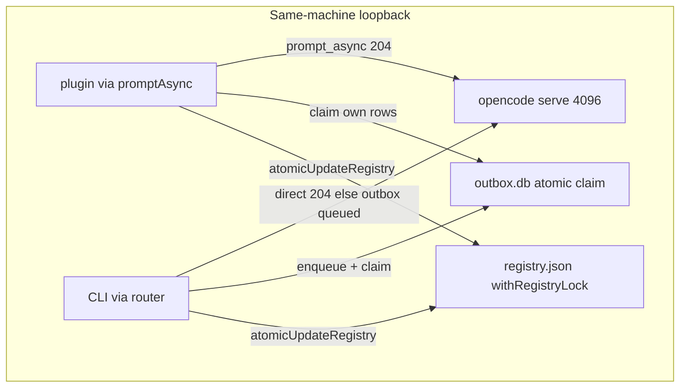

# Architecture: OpenCode-Mesh

> Newcomer map into [Architecture](docs/architecture.md)

OpenCode-Mesh is a same-machine loopback mesh that lets OpenCode
sessions message each other. Sends go direct over `prompt_async` when
the target's server answers, or queue in a local outbox for the
target's claimer to inject. Peers display as a never-hides union of
database truth, registry freshness, and live status.

## Map

*Figure 1: Registry plus outbox with plugin and CLI inject paths*

## Components

- Registry holds one `RegistryEntry` per session, written only via `atomicUpdateRegistry` under
  `withRegistryLock`; `agent` reads `unknown`, never NULL. See [schema.md](docs/schema.md) and [How storage persists](docs/architecture.md#how-storage-persists).
- The send path brands each body as `PromptInput` and admits direct on 204 with no inline send-path sleep.
  Waits live only in the claimer queue policy in the 550-650ms band; broadcast aggregates read `"mixed"` when legs differ. See [transport.md](docs/transport.md) and [How sends flow](docs/architecture.md#how-sends-work).
- `mesh_peers` shows the never-hides union with one `liveSource` badge per id. See
  [How discovery displays](docs/architecture.md#how-discovery-works) and [CONTEXT.md](CONTEXT.md).
- The outbox is a per-process claimed durable queue; receipts read `admitted` or `queued`. See
  [schema.md](docs/schema.md) and [transport.md](docs/transport.md).
- Presence rides the heartbeat with attach input and expiry precedence; `mesh_register` stays upsert-only. See
  [How storage persists](docs/architecture.md#how-storage-persists) and [configuration.md](docs/configuration.md).

## Start here

Bootstrap order lives in [Bootstrap](docs/architecture.md#bootstrap); every
knob lives in [configuration.md](docs/configuration.md).

## Gates

Gates live in [Gates](docs/architecture.md#gates)

Security scope lives in [Security Pointers](docs/architecture.md#security-pointers) plus [Security Policy](SECURITY.md)
